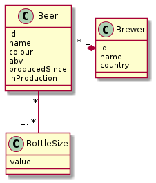

# Création de la base de données

## Etape 1: Créer une base de données
Créer une base de données MySQL appelée WS_BEERS

## Etape 2: Créer un utilisateur pour l'application
Créer un utilisateur spécifique à notre application: beer_admin

## Etape 3: Tables
Créer les tables en suivant le schéma suivant:

## Etape 4: Rendu
Rendre un fichier SQL permettant de faire toutes les étapes précédentes.
